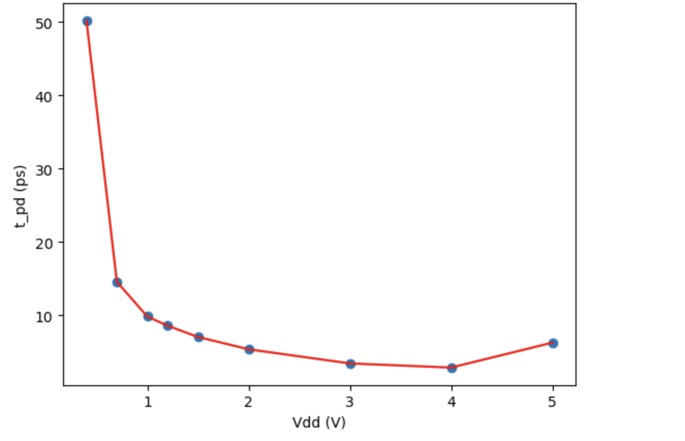

# Lab 4 README

## Ethan Gabizon, Dylan Lee, Nandita Nagarajan

### 1. Simulating row decoder
We used ADE L to generate PSF file from the waveforms generated from our test, and then parsed that in Matlab.
We submitted this PSF file and the Matlab script, so there is no need to re-run the decoder simulation. Simply open
`lab4_rowdecoder_testing.m` in Matlab and run, and it will automatically verify the test.

If you want to re-run the simulation:
The simulation schematic lives in the `lab4_rowdecoder_tb` cell. Open it, launch ADE L, and load `spectre_state1` from
cellview. Click netlist and run, then save the plot as a PSF file, making sure the name matches whatever you set at the
top of `lab4_rowdecoder_testing.m`. 

Our testing plan for the decoder was simple. We wrote a `veriloga` module to sweep all possible inputs (corresponding to
addresses 0-63), and verified that the output of the decoder was correct at all points.

### 2. Simulating static and dynamic margins

#### (a) Static noise margin
Open `lab4_snm`, launch ADE L, and load state `spectre_state1` from the cellview. Run the DC simulation. On the plot,
navigate to Axis -> Y vs Y. In the trace dropdown, select `/q` and select New Window.
With this plot still open, open `lab4_snm2`, launch ADE L, and load state `spectre_state1` from the cellview. Run the DC simulation,
navigate to Axis -> Y vs Y, select `/q`, and select New Window. Drag this plot into the window of the plot generated from `lab4_snm`. It
should look like this:

which gives us a static noise margin of about 250 mV.

#### (b) Read margin
Open `lab4_readmarg` and `lab4_readmarg2`, following all of the same steps as in (a). The plot should look like this:

which gives us a read margin of about 25 mV.

#### (c) Write margin
Open `lab4_writemarg` and `lab4_writemarg2`, following all of the same steps as in (a). The plot should look like this:

which gives us a write margin of about 250 mV.

### 3. Effect of Vdd scaling on read delay
We performed a quantitative analysis using the cell `lab4_sram_word_scaling` to determine the effect of Vdd scaling on 
read delay. We defined read delay to be the time between a wordline being asserted on a read and the bitline switching.
We were unable to perform a parametric sweep as we intended for this analysis, because our `veriloga` signal generator cell,
`lab4_8_sram_word_gen` is also responsible for setting the Vdd used for the simulation, which is not in scope as a design
variable for parametric sweeps. Using our data points, we compiled the following plot.

As shown, the minimum delay occurs somewhere between around Vdd = 4V. Vdd = 4V gives a read delay of 2.89 ps, down from
the delay of 8.61 ps that Vdd = 1.2V gives. However, dynamic power consumption is proportional to the square of Vdd,
which means that making this change in Vdd of about 3x would cause a 9x increase in dynamic power consumption. This may
be worth it depending on the application, but it is possible that is tradeoff is not worth it. 
